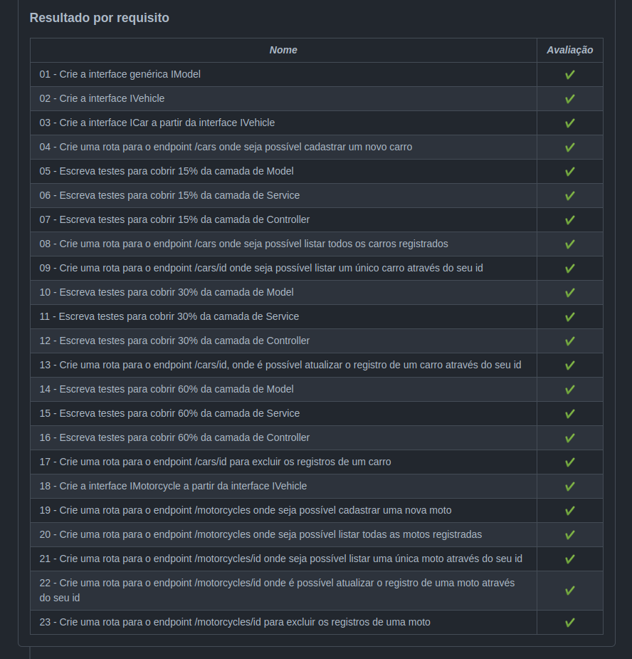

# Project Car Shop

## Sobre o projeto

Esse projeto foi desenvolvido por mim ([Igor Leal](www.linkedin.com/in/igorlealh)) aplicando os Princípios da Programação Orientada a Objetos(POO) para a contrução de uma API com `CRUD` para gerenciamento de veículos. O banco de dados utilizado foi o MongoDB.
O projeto foi iniciado ao final do Bloco 30 do Módulo de Back-end da [Trybe](https://www.betrybe.com/).

As ferramentas utilizadas foram:
  * *MongoDb*
  * *Docker*
  * *Mongoose*
  * *Sinon*
  * *Zod*
  * *express-async-errors*
  * *Jest*

Este projeto consiste em 17 requisitos obrigatórios, 6 requisitos bônus e 3 requisitos não avaliativos, somando um total de 26 requisitos.
Concluí 100% dos obrigatórios e 100% dos bônus.

Os requisitos não avaliativos são para desenvilvemento de testes para cobertura de 100% das linhas de cada camada da aplicação. Concluí 100% da cobertura dos testes das camadas de Model e Controller e 92.85% da camada de Service (uma feature é implementar 100% da cobertura  de testes desta camada).

---

## Iniciando o projeto na sua máquina

* Clonando o repositório: `git clone git@github.com:IgorHLeal/project-car-shop.git`;
* Instalando as dependências: `npm install`;
* Startando a aplicação: `npm run dev` (É necessário que a aplicação seja iniciada para que os teste possam rodar normalmente);
* Testando a aplicação: `npm test`;
* Testando a cobertura de testes: `npm run test:coverage`;

---

## Habilidades desenvolvidas

* Aplicação dos princípios da POO
* Construção de uma API com CRUD
* Implementação testes unitários com o Jest
* Aplicação de conceitos do MongoDB
* Criação de interfaces genéricas
* Aplicação de alguns conceitos do SOLID

---

## Aprovação final 

